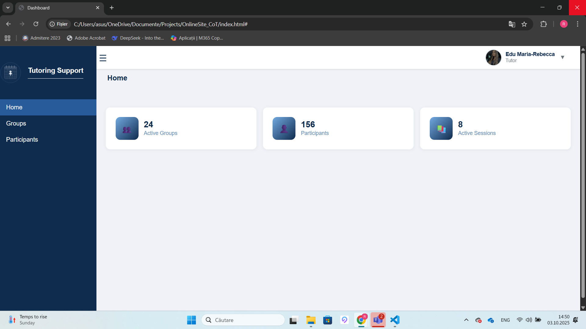
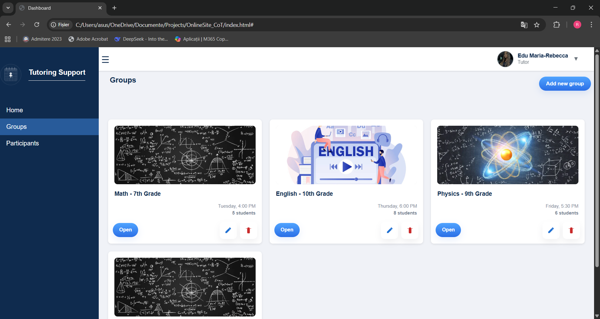
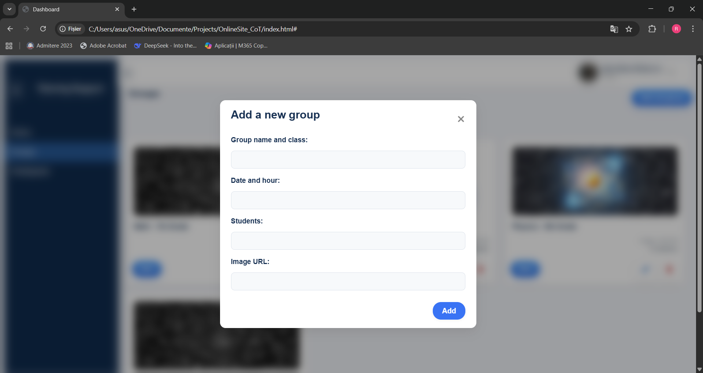
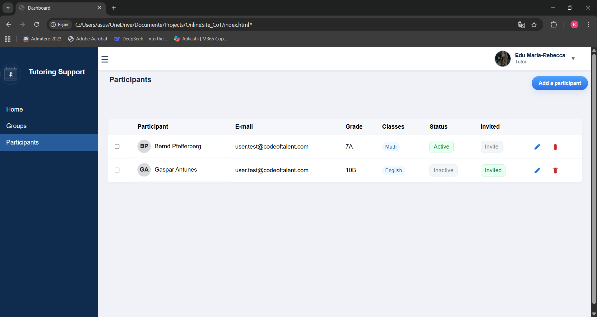
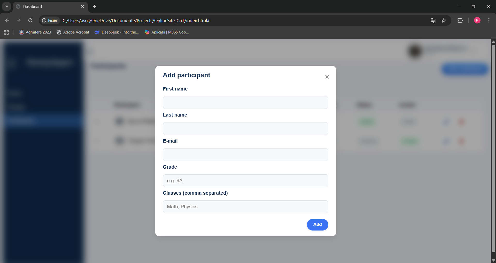

# Tutoring Support

**Tutoring Support** is a web-based dashboard built with **HTML, CSS, and Vanilla JavaScript**, designed to help manage study groups and participants in an intuitive and responsive way.  
The application provides essential features for organizing tutoring activities, including group management, participant handling, and data persistence through localStorage.

---

## 🚀 Features

- **Interactive Dashboard**  
  Clean and user-friendly interface for navigating between sections.

- **Study Groups Management**  
  - Create, edit, and delete groups (e.g., Math, English, Physics).  
  - Display group details with images, descriptions, and student counts.

- **Participant Management**  
  - Add, edit, and remove participants.  
  - Track details such as name, email, class, subjects, and status.  
  - Toggle between *Active/Inactive* and *Invited/Invite*.  
  - Display participants in a structured table view.

- **Responsive Design**  
  Works smoothly on desktop, tablet, and mobile devices.  

- **Local Data Persistence**  
  All groups and participants are stored in the browser’s **localStorage**, allowing data to remain available across sessions without a backend.

---

## 🛠️ Technologies Used

- **HTML5** – page structure, components (sidebar, navbar, content, forms, modals).  
- **CSS3** – layout, styling, responsive design with Flexbox & Grid.  
- **JavaScript (Vanilla)** – application logic, DOM manipulation, event handling, and localStorage integration.  

---

## 📂 Project Structure

Tutoring-Support/  
│  
├── index.html # Main application file  
├── index.js # JavaScript logic (navigation, groups, participants)  
├── css/  
│ └── main.css # Stylesheet  
├── assets/ # Images & logos  
│ ├── tutoring-logo-white.png  
│ ├── user.jpg  
│ ├── logo_mate.jpg  
│ ├── logo_eng.jpg  
│ └── logo_fizica.jpg  

---

## 📖 Application Layout

- **Sidebar** – navigation links (Home, Groups, Participants) + logo.  
- **Navbar** – user information and hamburger menu for mobile.  
- **Main Content** – dynamic display of current section:  
  - **Home** – welcome page (can be extended with stats/notifications).  
  - **Groups** – card view of study groups with CRUD operations.  
  - **Participants** – table view with participant actions.  

---

## ⚙️ Key Functionalities

- **Section Navigation** – smooth switching between pages.  
- **Groups** – add, edit, delete, display.  
- **Participants** – add, edit, invite, change status, remove.  
- **Modals** – pop-ups for data input (groups, participants).  
- **Data Persistence** – automatic saving and loading via localStorage.  

---

## 📸 Screenshots

### Dashboard – Home

### Groups Section

### Participants Section

## 👩‍💻 Author

**Edu Maria-Rebecca**  
A project focused on front-end development and dashboard design, showcasing strong skills in **HTML, CSS, JavaScript, and UI/UX design principles**.  
